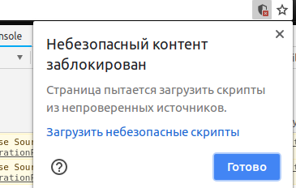

# Extension for toxic-elf

## Installation

1. Clone or download and extract **reddit_version branch** of this repo
2. Check an availability of API_PATH in request.js to the current url (Ask about it in telegram chat)
3. Import an extension to your browser
4. **Enable unsecure scripts for reddit** (instruction below)

5. Surf over the news! Toxic comments will appear in the end of a page... After a while.
